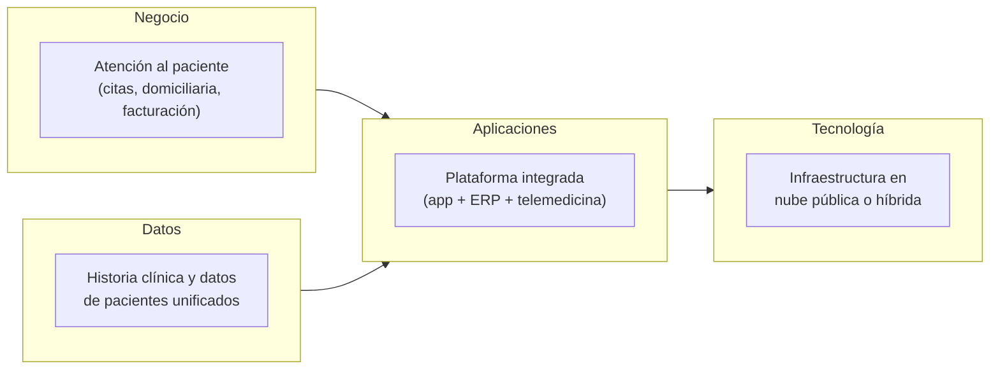
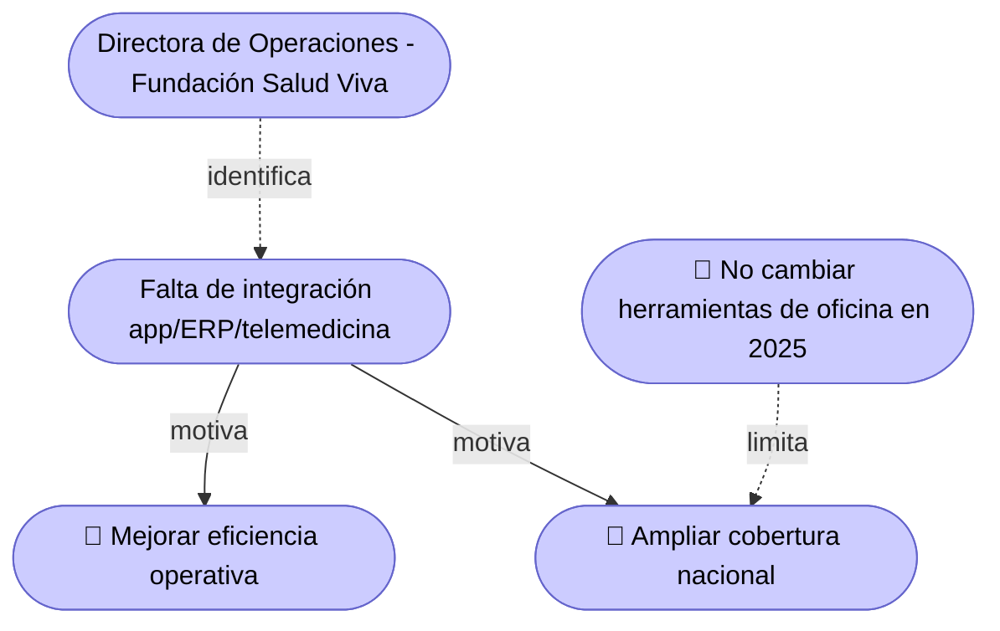

# 🧭 Guía Paso a Paso: Preliminary y Architecture Vision

Esta guía complementa el `README.md` del taller. Cubre las dos primeras fases de TOGAF ADM adaptadas al curso: **Preliminary** (la Ficha de Caracterización del Cliente) y **Architecture Vision** (la visión de alto nivel de la arquitectura y sus beneficios esperados). Todo lo que se construya aquí es la base sobre la que se apoyan los demás talleres del semestre — si el alcance queda mal definido acá, el error se arrastra hasta el Taller 9.

El diagrama de ejemplo está escrito en [Mermaid](https://mermaid.js.org/) y se renderiza automáticamente al ver este archivo en GitHub.

---

## Parte A — Preliminary: Ficha de Caracterización del Cliente

### A.1 Metodología en 5 pasos

1. **Levantar la información general del negocio** — empresa, sector, tamaño (empleados/usuarios), ubicación, tecnologías actuales.
2. **Documentar los objetivos estratégicos** — lo que el cliente quiere lograr como negocio, no como sistema. Deben ser específicos y verificables.
3. **Registrar los problemas o necesidades identificadas** — descritos como el cliente los vive (síntomas), no como una solución técnica ya decidida.
4. **Listar los procesos clave del negocio** — esta lista es el insumo directo del Taller 1 (BPMN): de aquí sale el proceso que el equipo modelará.
5. **Capturar expectativas, restricciones y persona de contacto** — qué espera el cliente de la solución, qué no se puede tocar, y quién responde las preguntas del equipo durante el semestre.

### A.2 Ejemplo guiado: Fundación Salud Viva

> Ejemplo tomado del material oficial del curso (`Material/Proyecto/Ejemplo_Ficha_Caracterización_del_Cliente`).

**I. Información general del negocio**
- Empresa: Fundación Salud Viva — sector salud (atención domiciliaria y telemedicina)
- Tamaño: 70 empleados / 2.500 usuarios mensuales activos
- Ubicación: Bogotá (oficina principal) + plataforma digital nacional
- Tecnologías actuales: Google Workspace, app móvil propia (Flutter), ERP en la nube (Zoho One)

**II. Objetivos estratégicos**
1. Mejorar la eficiencia operativa reduciendo el tiempo de atención por paciente.
2. Ampliar cobertura nacional sin duplicar costos operativos.
3. Aumentar el cumplimiento con normativas de seguridad en el manejo de datos clínicos.

**III. Problemas identificados** (nótese que son síntomas, no soluciones)
- Falta de integración entre la app móvil, el ERP y la plataforma de telemedicina.
- Dificultad para generar reportes integrales de pacientes y procesos.
- No existe una arquitectura formal documentada para planear futuras expansiones.

**IV. Procesos clave del negocio**
- Gestión de citas y agendamiento médico.
- Atención médica domiciliaria y seguimiento remoto.
- Gestión administrativa y facturación a aseguradoras.

**V. Expectativas y restricciones**
- Expectativas: claridad sobre qué transformar primero, poder escalar sin rehacer todo, identificar y mitigar riesgos tecnológicos.
- Restricciones: no se pueden cambiar las herramientas básicas de oficina en 2025; toda solución debe operar en nube pública o híbrida.

**VI. Persona de contacto**
- Nombre, correo/teléfono y rol frente a la solución.

---

## Parte B — Architecture Vision

### B.1 Metodología en 4 pasos

1. **Traducir los objetivos estratégicos en una visión de arquitectura** — para cada objetivo de la Ficha, formule qué debería cambiar en la arquitectura para lograrlo.
2. **Bocetar un mapa conceptual de alto nivel** — 4 a 6 cajas grandes (negocio, datos, aplicaciones, tecnología), sin el nivel de detalle de un BPMN o un C4. Ese detalle es trabajo de los Talleres 1 a 4, no de este.
3. **Justificar los beneficios esperados** — cada beneficio debe apuntar a un objetivo estratégico específico de la Ficha, no ser una afirmación genérica ("mejora la eficiencia" sin más).
4. **Delimitar el alcance** — qué queda dentro del proyecto y qué queda explícitamente fuera (muchas veces las restricciones de la Ficha ya definen parte del "fuera de alcance").

### B.2 Ejemplo guiado: Visión de Fundación Salud Viva

**Mapa conceptual de alto nivel** (obsérvese que es deliberadamente impreciso — el detalle llega después):

**Beneficios esperados**

| Objetivo estratégico (Ficha) | Beneficio esperado | Cómo se mide |
|---|---|---|
| Mejorar eficiencia operativa | Menos tiempo administrativo por paciente al integrar app, ERP y telemedicina | Minutos promedio de atención por paciente |
| Ampliar cobertura nacional | La plataforma soporta más usuarios sin duplicar infraestructura por ciudad | Costo operativo por usuario activo |
| Cumplir normativas de datos clínicos | Datos de pacientes con control de acceso y trazabilidad centralizados | Resultado del checklist normativo (Taller 6) |

**Alcance**

| En alcance | Fuera de alcance |
|---|---|
| Integración de app móvil, ERP y telemedicina | Reemplazo de Google Workspace (restricción de la Ficha) |
| Arquitectura de datos unificada de pacientes | Migración fuera de nube pública/híbrida |
| Documentación formal de la arquitectura actual y objetivo | Implementación real del sistema (el curso entrega el diseño, no lo construye) |

---

## Errores comunes a evitar

| Error frecuente | Por qué es un problema | Cómo corregirlo |
|---|---|---|
| Ficha con respuestas genéricas, sin datos reales del cliente | Compromete todo el semestre: si el alcance parte mal, el error se arrastra a todos los talleres siguientes | Base la ficha en una conversación real con el cliente, no en suposiciones |
| Confundir "problema" con "solución" en la sección de problemas | La ficha debe describir síntomas, no la respuesta técnica ya decidida | Escriba el problema como lo vive el cliente, no como una solución ("se necesita un data warehouse") |
| Visión sin conexión con los objetivos estratégicos de la Ficha | El resto del curso pierde el hilo de "para qué" se hace cada taller | Cada beneficio esperado debe apuntar a un objetivo estratégico específico |
| Mapa conceptual con el mismo nivel de detalle que un C4 o un BPMN | Adelanta trabajo de los Talleres 1-4 y sobra esfuerzo aquí | Mantenga el mapa a alto nivel: 4-6 cajas grandes, no procesos ni contenedores |

---

## Checklist de autoevaluación antes de entregar

- [ ] La ficha tiene información real del cliente, no genérica ni inventada.
- [ ] Los objetivos estratégicos son específicos y verificables.
- [ ] Cada problema identificado describe un síntoma, no ya una solución técnica.
- [ ] La visión de arquitectura conecta explícitamente con los objetivos estratégicos de la Ficha.
- [ ] El mapa conceptual se mantiene a alto nivel (no reemplaza los C4/BPMN de talleres posteriores).
- [ ] Están documentadas las restricciones y qué queda fuera de alcance.
- [ ] Hay una persona de contacto registrada, con rol claro frente a la solución.

---

## Vista ArchiMate equivalente

La Ficha y la Visión se traducen a la **capa de Motivación** de ArchiMate (ver la [Guía de Notación ArchiMate](https://github.com/CesarAVegaF312/AREM-ArchiMate/blob/main/guia_notacion_archimate.md) para el detalle completo): el cliente y su equipo directivo son **Stakeholders**, cada objetivo estratégico de la Ficha es un **Goal**, y cada restricción es una **Constraint**.

Estos elementos de Motivación son los que después reciben una **Realization** desde un Business Process (Taller 1) o una **Influence** desde un Requirement de seguridad (Taller 5) o normatividad (Taller 6) — la Ficha y la Visión son el punto de partida de esa trazabilidad, no un documento aislado.

---

_Esta guía hace parte del Taller 0 de Preliminary y Architecture Vision — curso Arquitectura Empresarial, Universidad de La Sabana._
