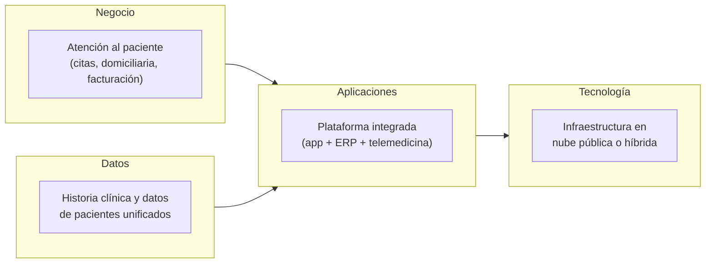
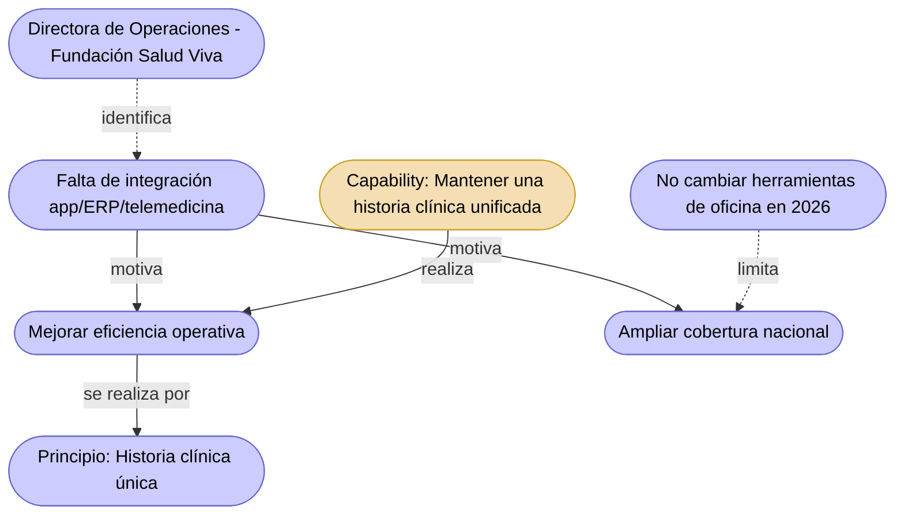

# Guía Paso a Paso: Preliminary y Architecture Vision

Esta guía complementa el `README.md` del taller. Cubre las dos primeras fases de TOGAF ADM adaptadas al curso: **Preliminary** (la Ficha de Caracterización del Cliente) y **Architecture Vision** (la visión de alto nivel de la arquitectura, sus beneficios esperados, las capacidades de negocio y un borrador de principios arquitectónicos). En TOGAF los principios nacen en la fase Preliminar y las capacidades en la Visión; por eso se piden aquí, en borrador, y no al final del curso: el Taller 7 madura las capacidades y el Taller 9 confirma los principios. Todo lo que se construya aquí es la base sobre la que se apoyan los demás talleres del semestre — si el alcance queda mal definido acá, el error se arrastra hasta el Taller 9.

El diagrama de ejemplo está escrito en [Mermaid](https://mermaid.js.org/) y se renderiza automáticamente al ver este archivo en GitHub.

---

## Parte A — Preliminary: Ficha de Caracterización del Cliente

### A.1 Metodología en 5 pasos

1. **Levantar la información general del negocio** — empresa, sector, tamaño (empleados/usuarios), ubicación, tecnologías actuales.
2. **Documentar los objetivos estratégicos** — lo que el cliente quiere lograr como negocio, no como sistema. Deben ser específicos y verificables.
3. **Registrar los problemas o necesidades identificadas** — descritos como el cliente los vive (síntomas), no como una solución técnica ya decidida.
4. **Listar los procesos clave del negocio** — esta lista es el insumo directo del Taller 1 (BPMN): de aquí sale el proceso que el equipo modelará.
5. **Capturar expectativas, restricciones y persona de contacto** — qué espera el cliente de la solución, qué no se puede tocar, y quién responde las preguntas del equipo durante el semestre.

### A.2 Ejemplo guiado: Fundación Salud Viva

> Ejemplo tomado del material oficial del curso — disponible en este mismo repositorio como [`clase/Ejemplo_Ficha_Cliente_Arquitectura_Empresarial.pdf`](Ejemplo_Ficha_Cliente_Arquitectura_Empresarial.pdf).

**I. Información general del negocio**
- Empresa: Fundación Salud Viva — sector salud (atención domiciliaria y telemedicina)
- Tamaño: 70 empleados / 2.500 usuarios mensuales activos
- Ubicación: Bogotá (oficina principal) + plataforma digital nacional
- Tecnologías actuales: Google Workspace, app móvil propia (Flutter), ERP en la nube (Zoho One)

**II. Objetivos estratégicos**
1. Mejorar la eficiencia operativa reduciendo el tiempo de atención por paciente.
2. Ampliar cobertura nacional sin duplicar costos operativos.
3. Aumentar el cumplimiento con normativas de seguridad en el manejo de datos clínicos.

**III. Problemas identificados** (nótese que son síntomas, no soluciones)
- Falta de integración entre la app móvil, el ERP y la plataforma de telemedicina.
- Dificultad para generar reportes integrales de pacientes y procesos.
- No existe una arquitectura formal documentada para planear futuras expansiones.

**IV. Procesos clave del negocio**
- Gestión de citas y agendamiento médico.
- Atención médica domiciliaria y seguimiento remoto.
- Gestión administrativa y facturación a aseguradoras.

**V. Expectativas y restricciones**
- Expectativas: claridad sobre qué transformar primero, poder escalar sin rehacer todo, identificar y mitigar riesgos tecnológicos.
- Restricciones: no se pueden cambiar las herramientas básicas de oficina en 2026; toda solución debe operar en nube pública o híbrida.

**VI. Persona de contacto**
- Nombre, correo/teléfono y rol frente a la solución.

---

## Parte B — Architecture Vision

### B.1 Metodología en 6 pasos

1. **Traducir los objetivos estratégicos en una visión de arquitectura** — para cada objetivo de la Ficha, formule qué debería cambiar en la arquitectura para lograrlo.
2. **Bocetar un mapa conceptual de alto nivel** — 4 a 6 cajas grandes (negocio, datos, aplicaciones, tecnología), sin el nivel de detalle de un BPMN o un C4. Ese detalle es trabajo de los Talleres 1 a 4, no de este.
3. **Justificar los beneficios esperados** — cada beneficio debe apuntar a un objetivo estratégico específico de la Ficha, no ser una afirmación genérica ("mejora la eficiencia" sin más).
4. **Delimitar el alcance** — qué queda dentro del proyecto y qué queda explícitamente fuera (muchas veces las restricciones de la Ficha ya definen parte del "fuera de alcance").
5. **Listar las capacidades de negocio** — de 5 a 8, con verbo + objeto y sin nombrar tecnología, a partir de los procesos clave de la Ficha (sección IV). Una capacidad es lo que la organización necesita saber hacer y sobrevive aunque cambie la herramienta: el cliente seguirá necesitando «facturar a aseguradoras» aunque reemplace el ERP. Para cada una, valore el soporte tecnológico actual (alto / medio / bajo) con la evidencia que dio el cliente. Esta lista es la que el Taller 7 (sección 4.1) madura con los hallazgos de los talleres intermedios y convierte en paquetes de trabajo.
6. **Escribir un borrador de 3 principios arquitectónicos** — cada uno con nombre, declaración (una frase) e implicación (qué queda prohibido o más caro), y cada uno salido de un objetivo estratégico o de una restricción de la Ficha. Un principio sirve si permite decir «no» a algo concreto; si no descarta ninguna opción, es una frase bonita. Es un borrador: el Taller 9 (plan de gobernanza) confirma, reescribe o retira cada principio con la evidencia de los Talleres 1 a 8.

### B.2 Ejemplo guiado: Visión de Fundación Salud Viva

> Vea la trazabilidad objetivo → síntoma → beneficio → caja del mapa en versión interactiva: [`clase/visualizacion-vision-preliminar.html`](visualizacion-vision-preliminar.html).

**Mapa conceptual de alto nivel** (obsérvese que es deliberadamente impreciso — el detalle llega después):

```mermaid
flowchart LR
    subgraph negocio["Negocio"]
        proc["Atención al paciente\n(citas, domiciliaria, facturación)"]
    end
    subgraph datos["Datos"]
        info["Historia clínica y datos\nde pacientes unificados"]
    end
    subgraph apps["Aplicaciones"]
        plat["Plataforma integrada\n(app + ERP + telemedicina)"]
    end
    subgraph tec["Tecnología"]
        nube["Infraestructura en\nnube pública o híbrida"]
    end

    negocio --> apps
    datos --> apps
    apps --> tec
```

**Beneficios esperados**

| Objetivo estratégico (Ficha) | Beneficio esperado | Cómo se mide |
|---|---|---|
| Mejorar eficiencia operativa | Menos tiempo administrativo por paciente al integrar app, ERP y telemedicina | Minutos promedio de atención por paciente |
| Ampliar cobertura nacional | La plataforma soporta más usuarios sin duplicar infraestructura por ciudad | Costo operativo por usuario activo |
| Cumplir normativas de datos clínicos | Datos de pacientes con control de acceso y trazabilidad centralizados | Resultado del checklist normativo (Taller 6) |

**Alcance**

| En alcance | Fuera de alcance |
|---|---|
| Integración de app móvil, ERP y telemedicina | Reemplazo de Google Workspace (restricción de la Ficha) |
| Arquitectura de datos unificada de pacientes | Migración fuera de nube pública/híbrida |
| Documentación formal de la arquitectura actual y objetivo | Implementación real del sistema (el curso entrega el diseño, no lo construye) |

**Capacidades de negocio (borrador)** — salen de los 3 procesos clave de la Ficha; dos son transversales porque las necesitan todos los procesos. Obsérvese que ninguna lleva nombre de sistema. La columna de evidencia extiende la ficha oficial con lo que una conversación con el cliente habría dejado: está aquí para mostrar el nivel de detalle esperado, no como dato del PDF.

| Capacidad (verbo + objeto) | Proceso(s) de la Ficha que la realizan | Soporte tecnológico hoy | Evidencia (qué dijo o mostró el cliente) |
|---|---|---|---|
| Agendar y gestionar citas | Gestión de citas y agendamiento médico | Alto | La app móvil agenda y notifica; el cliente no reporta fallas en este flujo |
| Atender pacientes a domicilio | Atención médica domiciliaria | Medio | Las visitas se programan en la app, pero el registro clínico se hace en formularios de Google Workspace |
| Hacer seguimiento remoto al paciente | Seguimiento remoto (telemedicina) | Medio | La plataforma de telemedicina funciona, pero no comparte datos con la app ni con el ERP |
| Mantener una historia clínica unificada | Transversal: citas, domiciliaria y telemedicina | Bajo | Problema #1 de la Ficha: la información del paciente vive en tres sistemas que no se hablan |
| Facturar a aseguradoras | Gestión administrativa y facturación | Medio | El ERP factura, pero los soportes clínicos se recopilan a mano desde los otros dos sistemas |
| Reportar la operación a la dirección | Transversal | Bajo | Problema #2 de la Ficha: no se pueden generar reportes integrales de pacientes y procesos |

**Principios arquitectónicos (borrador)** — cada uno descarta algo concreto y sale de un objetivo o de una restricción de la Ficha:

| Principio (nombre) | Declaración | Implicación (qué descarta) | Sale de |
|---|---|---|---|
| Historia clínica única | Cada dato clínico del paciente se captura una sola vez y tiene un sistema dueño; los demás lo consultan, no lo copian. | Descarta que la app, el ERP o la telemedicina guarden su propia versión del paciente; cualquier componente nuevo que duplique datos clínicos necesita una excepción aprobada. | Objetivo 1 (eficiencia operativa) y problema #1 (falta de integración) |
| Integración por servicios, no por archivos | Los sistemas se conectan por interfaces documentadas y versionadas, nunca por exportaciones manuales ni archivos compartidos. | Descarta el intercambio de hojas de cálculo entre app, ERP y telemedicina; encarece cualquier integración que no exponga una interfaz. | Objetivo 2 (cobertura nacional sin duplicar costos) |
| Nube pública o híbrida por defecto | Todo componente nuevo se despliega en nube pública o híbrida; Google Workspace y Zoho One no se reemplazan en 2026. | Descarta servidores propios en cada ciudad y descarta migrar el ERP o la ofimática este año. | Restricciones de la Ficha (sección V) |

> Estos tres principios son un borrador a propósito. Cuando el Taller 5 muestre, por ejemplo, que los datos clínicos viajan sin cifrar, el equipo agregará un principio de seguridad; y si el Taller 3 muestra que el ERP ya expone una interfaz, el segundo principio se confirma con esa evidencia. Ese cierre se hace en el plan de gobernanza del Taller 9.

---

## Errores comunes a evitar

| Error frecuente | Por qué es un problema | Cómo corregirlo |
|---|---|---|
| Ficha con respuestas genéricas, sin datos reales del cliente | Compromete todo el semestre: si el alcance parte mal, el error se arrastra a todos los talleres siguientes | Base la ficha en una conversación real con el cliente, no en suposiciones |
| Confundir "problema" con "solución" en la sección de problemas | La ficha debe describir síntomas, no la respuesta técnica ya decidida | Escriba el problema como lo vive el cliente, no como una solución ("se necesita un data warehouse") |
| Visión sin conexión con los objetivos estratégicos de la Ficha | El resto del curso pierde el hilo de "para qué" se hace cada taller | Cada beneficio esperado debe apuntar a un objetivo estratégico específico |
| Mapa conceptual con el mismo nivel de detalle que un C4 o un BPMN | Adelanta trabajo de los Talleres 1-4 y sobra esfuerzo aquí | Mantenga el mapa a alto nivel: 4-6 cajas grandes, no procesos ni contenedores |
| Capacidades con nombre de sistema («el ERP», «la app de citas») | Son aplicaciones, no capacidades: cambian cuando cambia la herramienta y el negocio no se reconoce en ellas | Verbo + objeto, sin tecnología: «Facturar a aseguradoras», no «Zoho One» |
| Principio que no descarta nada («La arquitectura debe ser flexible y segura») | Si no prohíbe ni encarece ninguna opción, no gobierna ninguna decisión | Escriba la implicación: qué queda prohibido o necesita excepción, y de qué objetivo o restricción sale |

---

## Checklist de autoevaluación antes de entregar

- [ ] La ficha tiene información real del cliente, no genérica ni inventada.
- [ ] Los objetivos estratégicos son específicos y verificables.
- [ ] Cada problema identificado describe un síntoma, no ya una solución técnica.
- [ ] La visión de arquitectura conecta explícitamente con los objetivos estratégicos de la Ficha.
- [ ] El mapa conceptual se mantiene a alto nivel (no reemplaza los C4/BPMN de talleres posteriores).
- [ ] Están documentadas las restricciones y qué queda fuera de alcance.
- [ ] Hay de 5 a 8 capacidades con verbo + objeto, cada una atada a un proceso de la Ficha y con su soporte tecnológico valorado con evidencia.
- [ ] Hay 3 principios en borrador con nombre, declaración e implicación, y cada uno sale de un objetivo o de una restricción de la Ficha.
- [ ] Hay una persona de contacto registrada, con rol claro frente a la solución.

---

## Vista ArchiMate equivalente

La Ficha y la Visión se traducen a la **capa de Motivación** de ArchiMate (ver la [Guía de Notación ArchiMate](https://github.com/CesarAVegaF312/AREM-ArchiMate/blob/main/guia_notacion_archimate.md) para el detalle completo): el cliente y su equipo directivo son **Stakeholders**, cada objetivo estratégico de la Ficha es un **Goal**, cada restricción es una **Constraint** y cada principio en borrador es un **Principle**. Las capacidades del paso 5 son elementos **Capability** de la **capa de Estrategia**: cada una realiza un Goal y la realizan los Business Process del Taller 1.

```mermaid
flowchart TD
    stakeholder(["Directora de Operaciones - Fundación Salud Viva"])
    driver(["Falta de integración app/ERP/telemedicina"])
    goal1(["Mejorar eficiencia operativa"])
    goal2(["Ampliar cobertura nacional"])
    constraint(["No cambiar herramientas de oficina en 2026"])
    principle(["Principio: Historia clínica única"])
    cap(["Capability: Mantener una historia clínica unificada"])

    stakeholder -.->|"identifica"| driver
    driver -->|"motiva"| goal1
    driver -->|"motiva"| goal2
    constraint -.->|"limita"| goal2
    goal1 -->|"se realiza por"| principle
    cap -->|"realiza"| goal1

    classDef motivacion fill:#ccccff,color:#000,stroke:#6666cc;
    classDef estrategia fill:#f5deb3,color:#000,stroke:#c9a227;
    class stakeholder,driver,goal1,goal2,constraint,principle motivacion
    class cap estrategia
```

Estos elementos de Motivación son los que después reciben una **Realization** desde un Business Process (Taller 1) o una **Influence** desde un Requirement de seguridad (Taller 5) o normatividad (Taller 6) — la Ficha y la Visión son el punto de partida de esa trazabilidad, no un documento aislado. Las mismas Capability reaparecen en el Taller 7 (sección 4.1) con su madurez AS-IS y TO-BE, y los Principle en la vista de Motivación del Taller 9.

---

_Esta guía hace parte del Taller 0 de Preliminary y Architecture Vision — curso Arquitectura Empresarial, Universidad de La Sabana._
